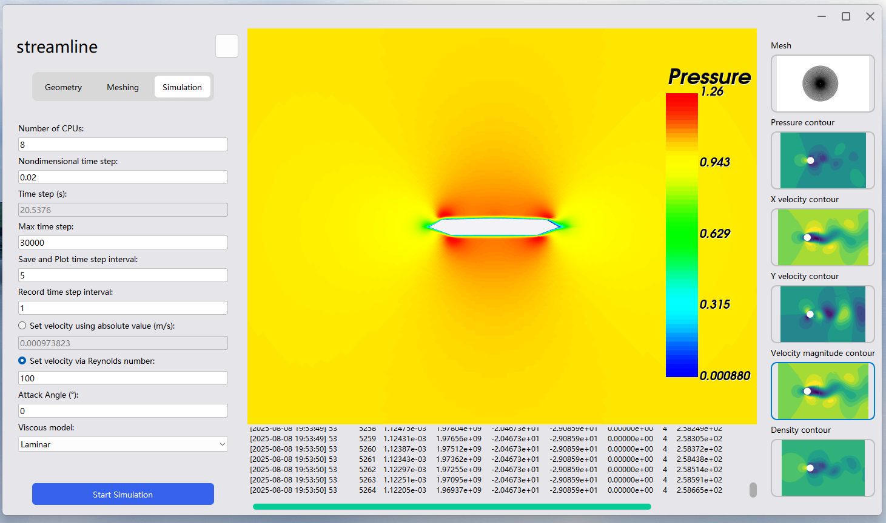

# 桥风智绘 - 基于国产CFD开源软件的智能桥梁抗风设计平台

[](https://www.gnu.org/licenses/gpl-3.0)

**BridgeWind** 是一款专为桥梁工程领域设计的二维断面风场计算流体动力学（CFD）模拟软件。它提供了一个从几何建模、网格生成到流场求解和后处理可视化的端到端集成解决方案，旨在帮助工程师和研究人员高效、准确地分析桥梁断面的空气动力学性能。
## 软件下载与使用
下载 Windows x64 安装包：
https://osredm.com/p70941386/BridgeWind/releases/download/1.0.2/BridgeWind-1.0.2-Setup.exe

您也可以下载已编译好的项目文件夹，并使用VS打开：
https://pan.baidu.com/s/1EKRSHdYOXqWORBE4fFz8ig?pwd=7ngu
提取码: 7ngu


## 核心特性

*   **灵活的几何建模**:
    *   **内置参数化模型**: 快速创建圆形、矩形、倒角矩形、流线型箱梁等多种典型桥梁截面。
    *   **支持DXF导入**: 通过集成 `libdxfrw` 库，可直接导入CAD软件生成的`.dxf`文件，无缝衔接现有设计流程。

*   **全自动高质量网格生成**:
    *   **智能拓扑分析**: 基于图论算法，自动分析几何拓扑，确保模型的封闭性和连续性。
    *   **类结构化网格**: 结合用户定义的参数，自动生成高质量的O型（或C型）四边形网格，显著提升计算精度和收敛性。
    *   **无缝集成Gmsh**: 在后端调用强大的开源网格划分工具Gmsh，并将生成的`.msh`网格自动转换为求解器所需的`.cgns`格式。

*   **集成化的PHengLEI求解器**:
    *   **自动化计算管线**: 封装了国产CFD求解器PHengLEI的完整计算流程，包括网格转换、分区和并行求解。
    *   **参数模板化**: 用户仅需在图形界面中输入物理参数（如雷诺数、攻角等），软件即可自动生成求解器所需的全部`.hypara`配置文件。

*   **先进的后处理与可视化**:
    *   **VTK驱动**: 基于强大的VTK（Visualization Toolkit）库，提供专业的科学可视化能力。
    *   **准实时监控**: 在计算过程中，可定时自动刷新流场数据，实现对压力、速度等物理量云图的动态监控。
    *   **现代化UI**: 使用Qt框架构建，拥有自定义的无边框界面和统一的视觉风格。

## 软件截图展示



## 系统需求

*   **操作系统**: Windows 10 / 11 (64位)
*   **处理器**: 推荐多核CPU (为并行计算提供支持)
*   **内存**: 8 GB RAM 或更高
*   **显卡**: 支持OpenGL 3.3及以上标准，并安装了最新的官方驱动程序。
    *   注意: 本软件的可视化功能依赖于良好的图形驱动支持。


# BridgeWind 编译指南 (Build Guide)

本文档为希望从源代码编译 BridgeWind 的开发者提供了详细的步骤和指导。此流程涉及手动从源码编译多个依赖库，并可能会手动修改项目中的 `CMakeLists.txt` 文件。

本项目的编译流程自动化程度不足，依赖很多手动操作。我们正在积极寻求改进构建系统的方案。

您可以下载已编译好的项目文件夹，并使用VS打开：

https://pan.baidu.com/s/1EKRSHdYOXqWORBE4fFz8ig?pwd=7ngu
提取码: 7ngu

## 1. 核心开发工具

请确保您的系统为`Windows 10`或`Windows 11`的`x64`位系统，确保您的开发环境中已安装以下核心工具：

-   **Visual Studio 2019** 或更高版本。安装时除默认选项外请勾选“使用C++的桌面开发”、“Windos 11 SDK”、“Windos 10 SDK”。 https://visualstudio.microsoft.com/
-   **CMake**: 版本 **3.15** 或更高。请确保已安装 `cmake-gui` 组件，并已将CMake添加到系统的 `PATH` 环境变量中。 https://github.com/Kitware/CMake/releases/download/v4.1.2/cmake-4.1.2-windows-x86_64.msi
-   **Git**: https://github.com/git-for-windows/git/releases/download/v2.51.0.windows.2/Git-2.51.0.2-64-bit.exe
-   **MS-MPI**: 下载时请勾选"msmpisdk.msi", "msmpisetup.exe"两个文件并安装。 https://www.microsoft.com/en-us/download/details.aspx?id=57467
-   **Gmsh**: https://gmsh.info/bin/Windows/gmsh-4.14.1-Windows64.zip
-   **Tecplot 360**: https://tecplot.com/products/tecplot-360/ 或者仅获取`tecio.dll`即可

## 2. 克隆桥风智绘（BridgeWind）仓库
1.  在您希望存放BrideWind源码的地方右键打开PowerShell，输入以下命令：
    ```
    git clone https://osredm.com/p70941386/BridgeWind
    ```
2. 克隆后，当前目录会出现`BridgeWind`文件夹，其中有BridgeWind完整的源码，但不包括第三方库的源码。关于第三方库的源码我们需要逐个获得并编译。后面提到的`BridgeWind`文件夹即此路径。
3. 在BridgeWind文件夹下新建一个"3rdPartyInstall"文件夹，用于存放**已编译好的**第三方库的二进制文件。

## 3. 编译依赖库 (从源码)

这是最关键且最耗时的部分。您需要依次下载并编译依赖库。我们推荐把所有依赖库安装到`BridgeWind/3rdPartyInstall`文件夹下，这样不需要手动编码`CMakeLists.txt`中的依赖路径。
 
如果您不熟悉使用`CMake GUI`和`Visual Studio`的编译流程，请先阅读以下内容：

---


### **使用 CMake GUI & Visual Studio 的通用编译流程**

对于这五个依赖：
```
HDF5
CGNS
VTK
libdxfrw
PhengLEI
```
请遵循此通用流程：

1.  **下载并解压源码**到您任意的位置，链接将在后面给出。
2.  在源码根目录下，创建一个名为 `build` 的空文件夹。
3.  **启动 CMake GUI** (`cmake-gui.exe`)。
4.  **设置路径**:
    -   "Where is the source code": 指向源码的根目录。
    -   "Where to build the binaries": 指向您创建的 `build` 目录。
5.  **首次配置**:
    -   点击 **"Configure"** 按钮。
    -   在弹出的窗口中，选择与您的 Visual Studio 版本匹配的生成器（例如 "Visual Studio 16 2019"），并确保平台为 `x64`。
    -   点击 "Finish"。CMake 将开始配置，期间可能会出现红色高亮的变量。
6.  **设置变量**:
    -   在 CMake GUI 的变量列表中，找到 `CMAKE_INSTALL_PREFIX`。将其值设置为 `BridgeWind/3rdPartyInstall`。
    -   根据下面每个库的具体说明，设置其他必要的变量（例如 `BUILD_SHARED_LIBS` 或指向其他依赖的 `..._DIR` 路径）。
7.  **再次配置与生成**:
    -   再次点击 **"Configure"**。所有红色高亮应该会消失。
    -   点击 **"Generate"**，CMake 将在 `build` 目录下生成 Visual Studio 解决方案 (`.sln`) 文件。
8.  **在 Visual Studio 中编译与安装**:
    -   点击 **"Open Project"** 或手动打开 `build` 目录中的 `.sln` 文件。
    -   将解决方案配置从 "Debug" 更改为 **"Release"**。
    -   在“解决方案资源管理器”中，右键点击 **`ALL_BUILD`** 项目并选择“生成”。
    -   编译成功后，右键点击 **`INSTALL`** 项目并选择“生成”。这会将编译好的文件（头文件、库、DLL等）整齐地复制到您在 `CMAKE_INSTALL_PREFIX` 中指定的目录。

---

### **逐个编译依赖：**

### **3.1 HDF5 (CGNS 的依赖)**

-   **推荐版本**: 1.14.4-3
-   **源码下载**: [HDF5 官网](https://www.hdfgroup.org/downloads/hdf5/source-code/)
(https://www.hdfgroup.org/downloads/hdf5/source-code/)
-   **编译说明**: 遵循上述“通用编译流程”。
    -   **CMake 变量设置**:
        -   `CMAKE_INSTALL_PREFIX`: `BridgeWind-deps/3rdPartyInstall/hdf5-install-release`
        -   `BUILD_SHARED_LIBS`: 勾选 (ON)

---

### **3.2 CGNS**

-   **推荐版本**: 4.4.0
-   **源码下载**: [CGNS GitHub Releases](https://github.com/CGNS/CGNS/releases)
(https://github.com/CGNS/CGNS/releases)
-   **编译说明**: 遵循上述“通用编译流程”。
    -   **CMake 变量设置**:
        -   `CMAKE_INSTALL_PREFIX`: `BridgeWind/3rdPartyInstall/CGNS-install-release`
        -   `BUILD_SHARED_LIBS`: 勾选 (ON)
        -   `CGNS_ENABLE_HDF5`: 勾选 (ON)
        -   `HDF5_DIR`: 设置为您之前 HDF5 的安装路径，指向包含 `HDF5Config.cmake` 的目录，即 `BridgeWind\3rdPartyInstall\hdf5-install-release\cmake`。

---

### **3.3 Qt 5 (使用安装包)**

对于Qt，不需要手动编译。使用官方安装包是最高效的方式。

-   **推荐版本**: 5.14.2
-   **下载链接**: [qt-opensource-windows-x86-5.14.2.exe](https://download.qt.io/archive/qt/5.14/5.14.2/qt-opensource-windows-x86-5.14.2.exe)
(https://download.qt.io/archive/qt/5.14/5.14.2/qt-opensource-windows-x86-5.14.2.exe)
-   **安装说明**:
    1.  运行安装程序。
    2.  在 "Select Components" 步骤中，勾选与您的编译器匹配的组件（例如 `MSVC 2019 64-bit`）。
    3.  记下安装路径，例如 `C:\Qt`。
    4.  将整个Qt文件夹复制到`BridgeWind/3rdPartyInstall/`文件夹下。推荐的复制后的目录应该为：
        ```
        BridgeWind
        ├── .git
        ├── 3rdPartyInstall
        │   ├── CGNS-install-release
        │   ├── hdf5-install-release
        │   └── Qt
        │       └── Qt5.14.2
        │           ├── 5.14.2
        │           │   └── msvc2017_64
        │           │       ├── lib
        │           │       │   └── cmake
        │           │       └── ...
        │           ├── dist
        │           ├── Docs
        │           └── ...
        ├── images
        ├── res
        ├── src
        └── translations
        ```

---

### **3.4 VTK**

-   **推荐版本**: 9.4.2
-   **源码下载**: [VTK 官网](https://vtk.org/download/)
(https://vtk.org/download/)
-   **编译说明**: 请确保已经编译了Qt。请遵循上述“通用编译流程”。
    -   **CMake 变量设置**:
        -   `CMAKE_INSTALL_PREFIX`: `BridgeWind\3rdPartyInstall\VTK-9.4.2-install-release`
        -   `BUILD_SHARED_LIBS`: 勾选 (ON)
        -   `VTK_GROUP_ENABLE_Qt`: 设置为 `YES`
        -   `VTK_QT_VERSION`: 设置为 `5`
        -   `Qt5_DIR`: 设置为您 Qt5 的安装路径，即 `BridgeWind/3rdPartyInstall/Qt/Qt5.14.2/5.14.2/msvc2019_64/lib/cmake/Qt5`。

---

### **3.5 libdxfrw**

-   **推荐版本**: 0.6.3
-   **下载链接**: [libdxfrw SourceForge](https://sourceforge.net/projects/libdxfrw/files/libdxfrw-0.6.3.tar.bz2/download)
(https://sourceforge.net/projects/libdxfrw/files/libdxfrw-0.6.3.tar.bz2/download)；
或使用git克隆：
```
git clone https://github.com/codelibs/libdxfrw.git
```
-   **编译说明**: 遵循上述“通用编译流程”。
    -   **CMake 变量设置**:
        -   `CMAKE_INSTALL_PREFIX`: `BridgeWind/3rdPartyInstall/libdxfrw-install-release`

---

### **3.6 风雷 (PHengLEI)**

-   **代码库地址**: [https://www.osredm.com/PHengLEI/PHengLEI](https://www.osredm.com/PHengLEI/PHengLEI)
-   请按照官方教程编译风雷。[查看官方教程](https://www.bilibili.com/video/BV1eX4y1T7yW)
(https://www.bilibili.com/video/BV1eX4y1T7yW)


## 4. 编译并运行 BridgeWind

我们推荐使用 Visual Studio 的 **"Open a local folder"** 功能来处理本项目。

**1. 在 Visual Studio 中打开项目**

1.  启动 Visual Studio。
2.  选择 **"Continue without code"** -> "File" -> "Open" -> "Folder..."。
3.  浏览并选择 `BridgeWind` 仓库的根目录。
4.  Visual Studio 将自动检测到 `CMakeLists.txt` 并开始配置项目。由于您已在文件中硬编码了路径，配置过程应该会成功。
   
**2. 手动修改 `src/CMakeLists.txt`**

1. 若您的目录设置完全按照上述步骤设置，您可以忽略此小节。

2. 若您的第三方库的安装目录未能完全严格按照上述步骤来设置，则您需要**直接修改** `BridgeWind/src/CMakeLists.txt` 文件，将依赖库的路径硬编码进去。

3. 打开 `BridgeWind/src/CMakeLists.txt`，在文件顶部或 `find_package` 命令之前，找到以下内容，并**确保路径与您自己的安装路径完全一致**。

    ```cmake
    # Release 版本设置路径
    if(CMAKE_BUILD_TYPE MATCHES "Release" OR CMAKE_CONFIGURATION_TYPES MATCHES "Release")
        list(APPEND CMAKE_PREFIX_PATH "./3rdPartyInstall/libdxfrw-install-release") # 指向你刚刚创建的 Release 版本
        list(APPEND CMAKE_PREFIX_PATH "./3rdPartyInstall/VTK-9.4.2-install-release/lib/cmake/vtk-9.4")
        list(APPEND CMAKE_PREFIX_PATH "./3rdPartyInstall/hdf5-install-release")
        list(APPEND CMAKE_PREFIX_PATH "./3rdPartyInstall/CGNS-install-release")
    endif()

    # Qt路径
    list(APPEND CMAKE_PREFIX_PATH "./3rdPartyInstall/Qt/Qt5.14.2/5.14.2/msvc2017_64")
    set(Qt5_DIR "./3rdPartyInstall/Qt/Qt5.14.2/5.14.2/msvc2017_64/lib/cmake/Qt5")
    ```


**3. 编译BridgeWind**

1.  在 Visual Studio 的“解决方案资源管理器”中，切换到 **CMake Targets View**。
2.  找到 `BridgeWindApp.exe` 目标。
3.  右键点击 `BridgeWindApp.exe` 并选择 **"Build"**。
4.  构建成功后，可执行文件将位于VS自动生成的构建目录中。即 `BridgeWind/out/build/x64-Release/src/BridgeWindApp.exe`。


**4. 配置依赖项**

1. 请复制编译好的风雷可执行文件`PHengLEIv3d0.exe`复制到`BridgeWind\res\PHengLEI_template`目录中。
2. 请将Gmsh安装目录中的`Gmsh.exe`复制到`BridgeWind\res\PHengLEI_template`目录中。
3. 请您找到Tecplot安装目录中的`tecio.dll`文件（通常在`C:\Program Files\Tecplot\Tecplot 360 EX 2022 R1\bin`），并同样复制到`BridgeWind\res\PHengLEI_template`。
4. 请将以下全部内容复制到`BridgeWind/out/build/x64-Release/`文件夹下：
   1. `BridgeWind\res\PHengLEI_template`整个文件夹；
   2. `BridgeWind\3rdPartyInstall\hdf5-install-release\bin`中的`hdf5.dll`；
   3. `BridgeWind\3rdPartyInstall\CGNS-install-release\bin`中的`cgnsdll.dll`；
   4. `BridgeWind\3rdPartyInstall\VTK-9.4.2-install-release\bin`文件夹下的全部文件。
5. 使用`windeployqt`解析BridgeWindApp.exe并为其配置依赖：
   1. 在开始菜单中找到`Qt 5.14.2 (MSVC 2017 64-bit)`打开，在命令行中输入：
        ```cmd
        cd "您的路径\BridgeWind\out\build\x64-Release\src"
        windeployqt BridgeWindApp.exe
        ```
    2. `windeployqt`命令会自动为您配置qt所需的依赖项。
6. 编译完成并且所有依赖项配置完成后，您的文件夹结构应该与此相同:
    ```
    BridgeWind
    ├── out
    │   └── build
    │       └── x64-Release
    │           └── src
    │               ├── BridgeWindApp_autogen/
    │               ├── BridgeWindCore_autogen/
    │               ├── BridgeWindUI_autogen/
    │               ├── CMakeFiles/
    │               ├── iconengines/
    │               ├── imageformats/
    │               ├── PHengLEI_template/
    │               ├── platforms/
    │               ├── styles/
    │               ├── TestApp_autogen/
    │               ├── translations/
    │               ├── BridgeWindApp.exe
    │               ├── BridgeWindCore.lib
    │               ├── BridgeWindUI.lib
    │               ├── TestApp.exe
    │               ├── bridgewind_de_DE.qm
    │               ├── bridgewind_zh_CN.qm
    │               ├── cgnsdll.dll
    │               ├── hdf5.dll
    │               ├── gmsh.exe
    │               ├── D3Dcompiler_47.dll
    │               ├── libEGL.dll
    │               ├── libGLESv2.dll
    │               ├── opengl32sw.dll
    │               ├── Qt5Core.dll
    │               ├── Qt5Gui.dll
    │               ├── Qt5Svg.dll
    │               ├── Qt5Widgets.dll
    │               ├── vtkcgns-9.4.dll
    │               ├── vtkChartsCore-9.4.dll
    │               ├── vtkCommonColor-9.4.dll
    │               ├── vtkCommonComputationalGeometry-9.4.dll
    │               └── 其他vtk库依赖...
    └── ...
    ```


## **编译完成！**

您可以直接从 Visual Studio 中设置 `BridgeWindApp.exe` 为启动项并运行。


若在编译时出现问题，可以下载已编译好的项目文件夹，使用VS打开文件夹即可：

https://pan.baidu.com/s/1EKRSHdYOXqWORBE4fFz8ig?pwd=7ngu
提取码: 7ngu

或者直接下载安装包：
https://osredm.com/p70941386/BridgeWind/releases/download/1.0.2/BridgeWind-1.0.2-Setup.exe

---
## 工作流程

1.  **创建项目**: 启动软件，创建一个新项目并指定工作目录。
2.  **定义几何**: 选择内置的参数化截面，或直接拖入一个`.dxf`文件。
3.  **设置网格参数**: 在“Meshing”选项卡中，定义周向/径向网格数量、增长率等参数。
4.  **生成网格**: 点击“Generate Mesh”，软件将自动完成拓扑分析、Gmsh调用和CGNS转换的全过程。
5.  **配置仿真参数**: 在“Simulation”选项卡中，设置来流速度（或雷诺数）、CPU核心数、求解时长等计算参数。
6.  **运行求解**: 点击“Start Simulation”，软件将启动PHengLEI求解器，并在日志窗口实时显示求解进程。
7.  **可视化分析**: 在计算过程中或计算结束后，通过右侧的视图选项卡切换查看网格、压力云图、速度云图等，进行交互式分析。


# 算例验证

## 低雷诺数圆柱绕流的验证
1. 几何设置请选择为圆形，直径设置为1(m).
2. 网格请按照下图设置：

    

    点击生成网格后生成的网格如图所示：
    
3. 求解器请按照下图设置：

    

4. 分别修改雷诺数为60、80、100、120、150、180、200。将计算得到稳态段的的升力系数、阻力系数记录在图表中，与Qu(2003)的结果对比：
   
   

    总体而言，无论是表征非定常涡脱落强度的升力系数，还是反映物体平均受力的阻力系数，“桥风智绘”的预测值都与基准数据吻合良好。

    参考文献：Qu L, Norberg C, Davidson L, Peng S H, Wang F. Quantitative numerical analysis of flow past a circular cylinder at Reynolds number between 50 and 200[J]. Journal of Fluids and Structures, 2013, 39: 347-370. DOI:10.1016/j.jfluidstructs.2013.02.007.

## 两类桥梁箱梁的三分力系数识别验证

1. 几何设置请按照下图设置：
   
    

2. 网格请按照下图设置：

    

    生成的网格如图所示：

    

    

3. 求解器请按照下图设置：
   
   

4. 对每隔箱梁分别计算[-10, -8, -6, -4, -2, 0, 2, 4, 6, 8, 10]度的九个攻角。分别记录其稳态段的阻力系数、升力系数和扭矩系数。与陈（2002）和Mannini和 Bartoli(2008)的结果对比，如图所示：
    

    通过与两种典型断面的基准数据对比，验证结果表明：“桥风智绘”软件对于流线型断面的关键气动参数（升、力矩）具有极高的定量预测精度，能够满足工程精细化分析的需求。

    参考资料：Mannini C, Bartoli G. Investigation on the dependence of bridge deck flutter derivatives on steady angle of attack[C]// Proceedings of the BBAA VI International Colloquium on Bluff Bodies Aerodynamics and Applications. Milano, Italy:  2008.

## 技术栈

*   **核心框架与语言**: C++ 17
*   **用户界面 (UI)**: Qt 5, QSS
*   **科学计算与可视化**:
    *   **VTK 9**: 用于所有2D/3D渲染和数据可视化。
    *   **CGNS**: 用于存储和交换CFD网格与数据。
    *   **HDF5**: 用于读取PHengLEI求解器输出的结果文件。
*   **几何与网格**:
    *   **Gmsh**: 后端网格生成引擎。
    *   **libdxfrw**: 用于DXF文件的读写。
*   **CFD 求解器**: **PHengLEI v3.0** (作为外部依赖)
*   **构建系统**: CMake

## 已知问题

*   在部分虚拟机环境（如 VMware Workstation）中，由于其虚拟显卡驱动对高级OpenGL特性的支持不完善，流场云图等复杂渲染可能会出现显示异常（例如花屏、色块）。这属于环境兼容性问题，**不影响核心计算功能的正确性**。为获得最佳体验，强烈建议在物理硬件上运行本软件。
*   
## 开源许可

本项目基于 **GNU General Public License v3.0** 开源。详细信息请参阅 [LICENSE](LICENSE) 文件。